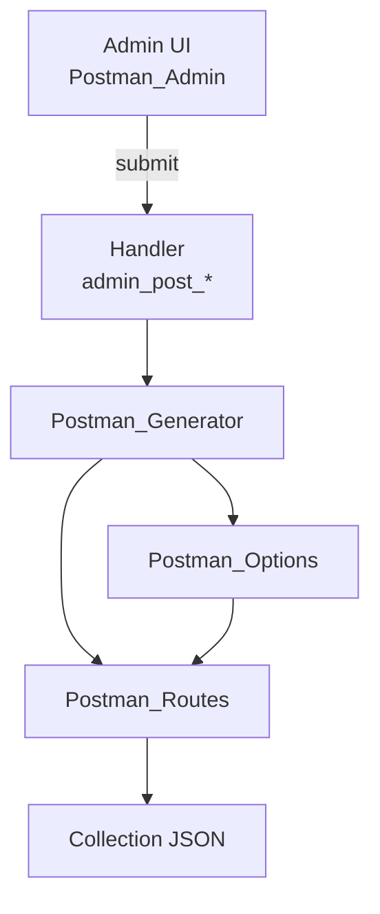

<!--
@file: docs/Project.md
@description: Детальное описание плагина MksDdn Postman Collection: цели, архитектура, стандарты, процессы.
@dependencies: mksddn-postman-collection/postman-collection.php, includes/class-postman-*.php
@created: 2025-08-19
-->

### MksDdn Postman Collection — проектная документация

**Цель**: предоставить удобный способ генерировать Postman Collection для REST API WordPress-сайта из админки и использовать плагин как независимый пакет, распространяемый через WordPress.org SVN и обновляемый по стандартному механизму.

Ссылка на стандарты WordPress плагинов: [Plugin Handbook](https://developer.wordpress.org/plugins/).

### Область применения
- Генерация Postman Collection v2.1.0 по публичным REST-маршрутам WordPress, в том числе:
  - базовые сущности WP (`pages`, `posts`, `categories`, `tags`, `taxonomies`, `comments`, `users`, `settings`)
  - пользовательские типы записей (CPT), включая специальные маршруты для `forms`
  - страницы опций (эндпоинты вида `/wp-json/custom/v1/options/...`)
  - индивидуально выбранные страницы по слагам
- Скачивание JSON-файла коллекции из админки.

### Архитектура и компоненты
- Пакет плагина: `mksddn-postman-collection/`
  - `postman-collection.php` — точка входа плагина (инициализация, константы, автозагрузка, регистрация хуков)
  - `includes/class-postman-admin.php` — админ-интерфейс: страница, форма выбора, обработчик `admin_post_*`
  - `includes/class-postman-generator.php` — сборка структуры коллекции и выдача JSON на скачивание
  - `includes/class-postman-options.php` — извлечение и кэширование страниц опций через REST server и роуты
  - `includes/class-postman-routes.php` — генерация маршрутов для базовых сущностей, CPT, форм и индивидуальных страниц

Примечание по интеграции с формами:
- Если установлен и активен плагин `mksddn-forms-handler`, коллекция для форм использует namespace `mksddn-forms-handler/v1` и пути `wp-json/mksddn-forms-handler/v1/forms` для list и submit; иначе — стандартные `wp/v2/forms`.
 - Для каждой формы добавляются два роута:
   - GET `wp-json/mksddn-forms-handler/v1/forms/{slug}` — получение информации о форме
   - POST `wp-json/mksddn-forms-handler/v1/forms/{slug}/submit` — отправка данных формы (тело запроса заполняется автогенерируемыми примерами значений)

Примеры генерации тестовых данных для полей форм:
- Поддерживаются типы: `text`, `email`, `password`, `tel`, `url`, `number` (учёт `min`/`max`/`step`), `date`, `time`, `datetime-local`, `textarea`, `checkbox`, `radio`, `select` (включая `multiple`), `file` (включая `multiple`).
- Для `select`/`radio` поддерживаются варианты options как массив строк или массив объектов `{value,label}`; выбирается первое значение (или первые 1–2 при `multiple`).
- Для `file` генерируются имена файлов-заглушек (`sample.pdf`), при `multiple` — массив значений.

Диаграмма на высоком уровне:

### Точки расширения и интеграции
- Хуки WordPress:
  - `admin_menu` — добавление страницы админки
  - `admin_post_generate_postman_collection` — обработка генерации
  - `init` — инициализация плагина
- В планах: добавить собственные фильтры для модификации элементов коллекции и переменных (см. дорожную карту).
 - Добавлены фильтры расширения:
   - `mksddn_postman_collection` — модификация финального массива коллекции
   - `mksddn_postman_filename` — переопределение имени экспортируемого файла

### Требования и совместимость
- Требования:
  - WordPress ≥ 6.2 (Tested up to 6.6)
  - PHP ≥ 8.1
- Безопасность:
  - Защита прямого доступа через `ABSPATH`
  - Проверка прав `manage_options` и `check_admin_referer` для генерации
  - Экранирование вывода в админке (`esc_html`, `esc_attr`, `esc_url`)
  - Санитизация входящих данных из `$_POST`
- Производительность:
  - Ленивая загрузка страниц опций (`Postman_Options::load_options_pages_if_needed`)
  - Автозагрузчик классов, отсутствие тяжёлых зависимостей

### Соответствие WordPress Plugin Check (PCP)
- Заголовки плагина: `Requires at least`, `Tested up to`, `Requires PHP`, `Text Domain: mksddn-postman-collection`, `Domain Path: /languages`, `License`, `License URI`, `Author URI`, `Plugin URI`.
- I18n: добавить `load_plugin_textdomain('mksddn-postman-collection')`, обернуть строки UI в `__()/esc_html__()`; подготовить `.pot`.
- Экранирование всего HTML/атрибутов в админке.
- PHPCS (WordPress Coding Standards), PHPCompatibility.
- Readme.txt в формате WordPress.org с тегами, кратким/полным описанием, установкой, Changelog.

### Стандарты и стиль
- Код-стайл: WordPress Coding Standards (WPCS). Проверки выполняются локально (без CI).
- Статика: PHPStan/Psalm (уровень 5-6) — опционально.
- Семантическое версионирование: `MAJOR.MINOR.PATCH`.

### Структура репозиториев и релизы
- GitHub: весь репозиторий (включая `docs/`).
- WordPress.org SVN: пушим только содержимое директории `mksddn-postman-collection/`.
- Релизный процесс:
  1) Обновить версию в `postman-collection.php` и `readme.txt`.
  2) Прогнать PCP и PHPCS локально.
  3) Тег в Git, экспорт в SVN `trunk/`, подготовка `tags/x.y.z`.
  4) Публикация, проверка автообновлений.

### План работ (high-level)
1) Формализация метаданных плагина для PCP
2) Полная i18n и загрузка text-domain
3) Жёсткое экранирование/санитизация в админ-форме
4) Readme.txt (WP.org) и скриншоты/иконки
5) Локальные проверки PCP/PHPCS (без CI)
6) Пользовательские фильтры для расширяемости

### Консистентность и поддерживаемость
- Единая архитектура классов с чёткими зонами ответственности.
- Документация обновляется при каждом значимом изменении (см. `docs/changelog.md`).
- Минимизировать глобальные состояния; использовать константы только для путей/версий.
- Никаких «магических» строк без констант/помощников.

### Известные пробелы (для бэклога)
- Не хватает: i18n, заголовков и readme для каталога плагинов, PHPCS-конфига.

