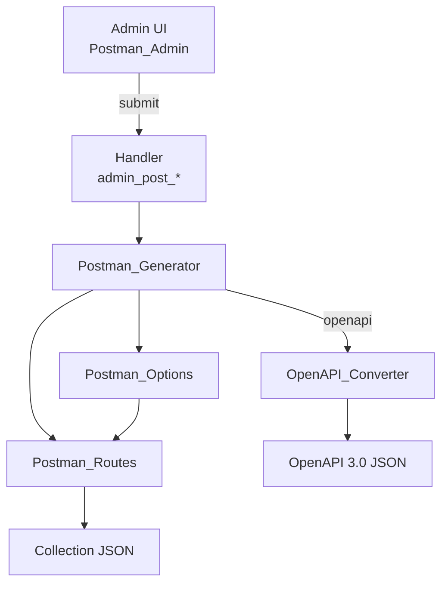

<!--
@file: docs/Project.md
@description: Детальное описание плагина MksDdn Postman Collection: цели, архитектура, стандарты, процессы.
@dependencies: mksddn-postman-collection/postman-collection.php, includes/class-postman-*.php
@created: 2025-08-19
-->

### MksDdn Postman Collection — проектная документация

**Цель**: предоставить удобный способ генерировать Postman Collection и OpenAPI 3.0 документацию для REST API WordPress-сайта из админки и использовать плагин как независимый пакет, распространяемый через WordPress.org SVN и обновляемый по стандартному механизму.

Ссылка на стандарты WordPress плагинов: [Plugin Handbook](https://developer.wordpress.org/plugins/).

### Область применения
- Генерация Postman Collection v2.1.0 по публичным REST-маршрутам WordPress, в том числе:
  - базовые сущности WP (`pages`, `posts`, `categories`, `tags`, `taxonomies`, `comments`, `users`, `settings`)
  - WooCommerce REST API (wc/v3): `products`, `products/categories`, `orders` — при активном плагине WooCommerce
  - поиск по контенту (`search` с поддержкой фильтрации по типам)
  - пользовательские типы записей (CPT), включая специальные маршруты для `forms`
  - страницы опций (эндпоинты вида `/wp-json/custom/v1/options/...`)
  - индивидуально выбранные страницы по слагам
  - выбор категорий и автоматические запросы постов по выбранным категориям
  - выбор Custom Post Types для включения в коллекцию
  - опциональное включение ACF полей в запросы списков (List of pages, List of posts, List of CPT) через чекбоксы в админке
- Автоматическое включение SEO-данных Yoast (`yoast_head_json`) в параметр `_fields` для pages и posts при активном плагине Yoast SEO
- Поддержка многоязычности через заголовок `Accept-Language` во всех GET-запросах
- Скачивание JSON-файла коллекции (Postman) или OpenAPI 3.0 спецификации из админки.

### Архитектура и компоненты
- Пакет плагина: `mksddn-postman-collection/`
  - `postman-collection.php` — точка входа плагина (инициализация, константы, автозагрузка, регистрация хуков)
  - `includes/class-postman-admin.php` — админ-интерфейс: страница, форма выбора (страницы, категории и Custom Post Types), выбор формата экспорта (Postman/OpenAPI), обработчик `admin_post_*`
  - `assets/css/admin.css` — унифицированные стили блоков страницы экспорта. Структура блока: `postman-admin-block` (обёртка), `postman-admin-block__title`, `postman-admin-block__actions` (кнопки), `postman-admin-block__content` (варианты: `--scrollable` для списков, `--options` для чекбоксов/радио), `postman-admin-block__description`. Новый блок: `render_block_start()` → контент → `render_block_end()`.
  - `includes/class-postman-generator.php` — сборка структуры коллекции, выдача Postman JSON или OpenAPI 3.0 на скачивание
  - `includes/class-postman-openapi-converter.php` — конвертация Postman Collection в OpenAPI 3.0; параметры, пагинация (X-WP-Total, X-WP-TotalPages), auth; ссылки на https://developer.wordpress.org/rest-api/
  - `includes/class-postman-openapi-schemas.php` — OpenAPI schemas для WP сущностей (Post, Page, Term, User, Comment, Error) с ссылками на Reference; security schemes по https://developer.wordpress.org/rest-api/using-the-rest-api/authentication/
  - `includes/class-postman-param-descriptions.php` — централизованные описания query/header/request body параметров для Postman и OpenAPI
  - `includes/class-postman-options.php` — извлечение и кэширование страниц опций через REST server и роуты
  - `includes/class-postman-routes.php` — генерация маршрутов для базовых сущностей, CPT, форм, индивидуальных страниц и списка постов по выбранным категориям

Примечание по интеграции с формами:
- Если установлен и активен плагин `mksddn-forms-handler`, коллекция для форм использует namespace `mksddn-forms-handler/v1` и пути `wp-json/mksddn-forms-handler/v1/forms` для list и submit; иначе — стандартные `wp/v2/forms`.
 - Для каждой формы добавляются два роута:
   - GET `wp-json/mksddn-forms-handler/v1/forms/{slug}` — получение информации о форме
   - POST `wp-json/mksddn-forms-handler/v1/forms/{slug}/submit` — отправка данных формы (тело запроса заполняется автогенерируемыми примерами значений)

Примечание по интеграции с WooCommerce:
- При активном плагине WooCommerce в коллекцию добавляется папка "WooCommerce" с маршрутами: Products (List, by ID, Create, Update, Delete), Product Categories (аналогично), Orders (аналогично)
- Аутентификация: HTTP Basic Auth (Consumer Key + Consumer Secret). Ключи создаются в WooCommerce > Settings > Advanced > REST API
- Переменные коллекции: `wcConsumerKey`, `wcConsumerSecret`, `ProductID`, `ProductCategoryID`, `OrderID`
- CPT `product` исключается из списка Custom Post Types (маршруты уже в папке WooCommerce)

Примечание по интеграции с Yoast SEO:
- Если установлен и активен плагин Yoast SEO (`wordpress-seo/wp-seo.php`), параметр `_fields` для pages и posts автоматически дополняется значением `yoast_head_json`
- Это позволяет получать SEO-метаданные (title, description, og:tags и т.д.) через REST API без дополнительных запросов

Примечание по поддержке многоязычности:
- Все GET-запросы в коллекции автоматически включают заголовок `Accept-Language` с языком по умолчанию
- Приоритет определения языка:
  1. Если активен плагин Polylang, используется язык по умолчанию из его настроек (`pll_default_language()`)
  2. Иначе используется язык из настроек WordPress (`get_locale()`)
- Язык автоматически преобразуется в формат RFC 5646 (например, `ru_RU` → `ru-RU`)
- Это обеспечивает поддержку многоязычных сайтов с приоритетом настроек Polylang

Примечание по поиску:
- Добавлена папка "Search" с тремя типами поисковых запросов:
  - `Search Posts` - поиск только по записям (`type=post`)
  - `Search Pages` - поиск только по страницам (`type=page`)
  - `Search All` - поиск по всем типам контента
- Все поисковые запросы используют параметр `search=example` как пример
- Поддерживается параметр `_fields` для оптимизации ответа
- Поиск работает через стандартный WordPress REST API endpoint `/wp-json/wp/v2/search`

Примечание по пагинации:
- Все запросы типа "List of ..." (List of Posts, List of Pages, List of any CPT и т.п.) автоматически включают параметры пагинации `page` и `per_page`
- Параметры пагинации по умолчанию отключены (`disabled: true`) в Postman, чтобы не влиять на существующие запросы
- Значения по умолчанию: `page=1`, `per_page=10`
- Параметры пагинации добавляются для всех сущностей, поддерживающих пагинацию в WordPress REST API (posts, pages, categories, tags, comments, users, CPT), за исключением `settings`

Примечание по ACF/SCF полям:
- Если установлен плагин ACF (Advanced Custom Fields) или SCF (Smart Custom Fields), параметры `acf_format=standard` и поле `acf` в `_fields` автоматически включаются для всех типов записей (pages, posts, CPT) — для списков и для одиночных записей по slug/ID
- Если плагин не установлен, ACF-поля в ответах не добавляются

Примеры генерации тестовых данных для полей форм:
- Поддерживаются типы: `text`, `email`, `password`, `tel`, `url`, `number` (учёт `min`/`max`/`step`), `date`, `time`, `datetime-local`, `textarea`, `checkbox`, `radio`, `select` (включая `multiple`), `file` (включая `multiple`).
- Для `select`/`radio` поддерживаются варианты options как массив строк или массив объектов `{value,label}`; выбирается первое значение (или первые 1–2 при `multiple`).
- Для `file` генерируются имена файлов-заглушек (`sample.pdf`), при `multiple` — массив значений. При наличии хотя бы одного `file`-поля тело запроса для Submit Form формируется как `multipart/form-data` (Postman Body → form-data):
  - поля `file` добавляются как элементы типа File (ключ `src` указывает на локальный файл-заглушку)
  - текстовые поля добавляются как элементы типа Text
  - заголовок `Content-Type` не устанавливается вручную (Postman добавит boundary автоматически)

Диаграмма на высоком уровне:

### Точки расширения и интеграции
- Хуки WordPress:
  - `admin_menu` — добавление страницы админки
  - `admin_post_generate_postman_collection` — обработка генерации
  - `init` — инициализация плагина
- В планах: добавить собственные фильтры для модификации элементов коллекции и переменных (см. дорожную карту).
 - Добавлены фильтры расширения:
   - `mksddn_postman_collection` — модификация финального массива коллекции
   - `mksddn_postman_filename` — переопределение имени экспортируемого файла Postman
   - `mksddn_postman_openapi_spec` — модификация OpenAPI 3.0 спецификации перед экспортом
   - `mksddn_postman_openapi_filename` — переопределение имени файла OpenAPI

### Требования и совместимость
- Требования:
  - WordPress ≥ 6.2 (Tested up to 6.6)
  - PHP ≥ 8.1
- Безопасность:
  - Защита прямого доступа через `ABSPATH`
  - Проверка прав `manage_options` и `check_admin_referer` для генерации
  - Экранирование вывода в админке (`esc_html`, `esc_attr`, `esc_url`)
  - Санитизация входящих данных из `$_POST`
- Производительность:
  - Ленивая загрузка страниц опций (`Postman_Options::load_options_pages_if_needed`)
  - Автозагрузчик классов, отсутствие тяжёлых зависимостей

### Соответствие WordPress Plugin Check (PCP)
- Заголовки плагина: `Requires at least`, `Tested up to`, `Requires PHP`, `Text Domain: mksddn-postman-collection`, `Domain Path: /languages`, `License`, `License URI`, `Author URI`, `Plugin URI`.
- I18n: добавить `load_plugin_textdomain('mksddn-postman-collection')`, обернуть строки UI в `__()/esc_html__()`; подготовить `.pot`.
- Экранирование всего HTML/атрибутов в админке.
- PHPCS (WordPress Coding Standards), PHPCompatibility.
- Readme.txt в формате WordPress.org с тегами, кратким/полным описанием, установкой, Changelog.

### Стандарты и стиль
- Код-стайл: WordPress Coding Standards (WPCS). Проверки выполняются локально (без CI).
- Статика: PHPStan/Psalm (уровень 5-6) — опционально.
- Семантическое версионирование: `MAJOR.MINOR.PATCH`.

### Структура репозиториев и релизы
- GitHub: весь репозиторий (включая `docs/`).
- WordPress.org SVN: пушим только содержимое директории `mksddn-postman-collection/`.
- Релизный процесс:
  1) Обновить версию в `postman-collection.php` и `readme.txt`.
  2) Прогнать PCP и PHPCS локально.
  3) Тег в Git, экспорт в SVN `trunk/`, подготовка `tags/x.y.z`.
  4) Публикация, проверка автообновлений.

### План работ (high-level)
1) Формализация метаданных плагина для PCP
2) Полная i18n и загрузка text-domain
3) Жёсткое экранирование/санитизация в админ-форме
4) Readme.txt (WP.org) и скриншоты/иконки
5) Локальные проверки PCP/PHPCS (без CI)
6) Пользовательские фильтры для расширяемости

### Консистентность и поддерживаемость
- Единая архитектура классов с чёткими зонами ответственности.
- Документация обновляется при каждом значимом изменении (см. `docs/changelog.md`).
- Минимизировать глобальные состояния; использовать константы только для путей/версий.
- Никаких «магических» строк без констант/помощников.

### Известные пробелы (для бэклога)
- Не хватает: i18n, заголовков и readme для каталога плагинов, PHPCS-конфига.

